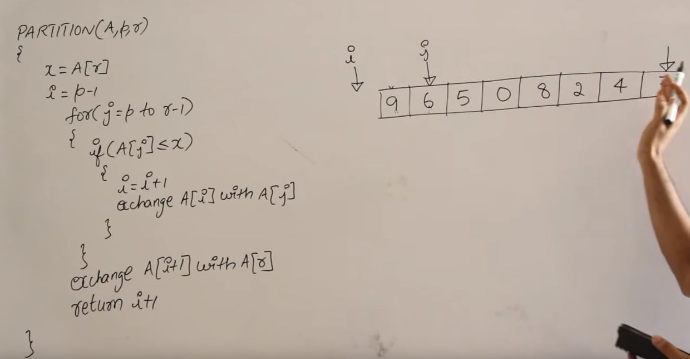

# Quick Sort (퀵 정렬)
### 참고자료
* [퀵정렬 유튜브 영문](https://www.youtube.com/watch?v=3DV8GO9g7B4) - step by step으로 화이트보드에 설명해줘서 아주 쉽게 이해됨
  * 
* [퀵정렬 샘플코드 참고](https://www.geeksforgeeks.org/java-program-for-quicksort/)


``` java
public class QuickSort {
    // input은 정렬할 배열, low는 input 배열의 시작 원소 인덱스, high는 input 배열의 끝 원소 인덱스
    public int[] sort(int[] input, int low, int high) {
        int pi; // partitioning index - pivot으로 쓰기도 하지만 pivot보다는 partitioning index가 더 사용목적에 맞는 이름

        // low가 high보다 크거나 같으면 sorting 종료
        if (low < high) {
            pi = partition(input, low, high);
            sort(input, low, pi - 1); // pi를 기준으로 좌측은 pivot보다 작은 수들의 모임
            sort(input, pi + 1, high); // pi를 기준으로 우측은 pivot보다 큰 수들의 모임
        }
        return input;
    }

    private int partition(int[] input, int low, int high) {
        int pivot = input[high]; // pivot을 정하는 여러 기준이 있지만 제일 우측의 원소를 pivot으로 선택함
        int i = low - 1; // pivot보다 작은 수들 중 제일 오른쪽에 위치한 원소를 가리키는 변수
        for (int j = low; j < high; j++) {
            if (input[j] <= pivot) {
                i++; // pivot보다 작은 수를 발견했으므로 pivot보다 작은 수들 중 제일 오른쪽에 위치하는 원소를 가리키는 변수인 i를 +1하여 작은 수들 중 제일 오른쪽에 위치한 원소를 가리키는 인덱스가 되게 한다

                int temp = input[j];
                input[j] = input[i];
                input[i] = temp;
            }
        }

        // 더이상 비교할 게 없고 pivot 이었던 제일 오른쪽의 원소와 i+1의 인덱스를 가지는 원소와 swap한다
        int temp = input[high];
        input[high] = input[i+1];
        input[i+1] = temp;

        return i+1;
    }

    // main에 작성하기보다 test로 작성해서 실행하는 편, main은 코드 돌려보실 분들 편의상
    public static void main(String[] args) {
        QuickSort quickSort = new QuickSort();
        int[] input = {8, 6, 1, 3, 2};
        int[] output = {1, 2, 3, 6, 8};
        System.out.println("Input : " + Arrays.toString(input));
        System.out.println("Output : " + Arrays.toString(quickSort.sort(input, 0, input.length - 1)));
    }
}
```