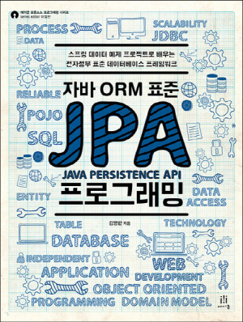
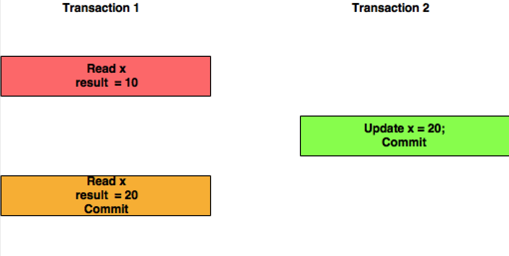
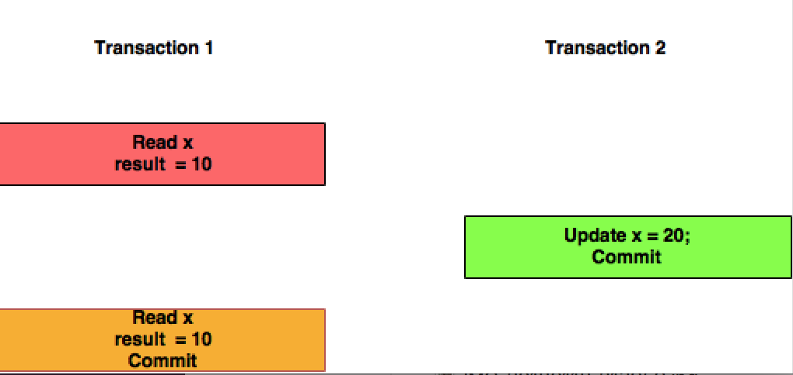

# JPA 프로그래밍 기본기 다지기

연사

* 김영한님
* 우아한 형제들 재직중
* 저서 [<자바 ORM 표준 JPA 프로그래밍>](http://www.kyobobook.co.kr/product/detailViewKor.laf?ejkGb=KOR&mallGb=KOR&barcode=9788960777330&orderClick=LAG&Kc=) (a.k.a. 국내 JPA 바이블)



일시 및 장소

* 2018년 11월 22일 목요일
* SK플래닛 T아카데미 (서울대연구공원단지내 SK연구동)

## 왜 JPA인가

* 데이터베이스 세상의 헤게모니는 관계형 데이터베이스가 들고 있다
* 지금 시대는 객체를 관계형 데이터베이스로 관리한다
* NoSQL, MongoDB 등은 특수한 경우가 아니라면 관계형 데이터베이스가 메인이며 서브로 가져다 쓰는 정도
* 관계형 데이터베이스로 개발하다보면 CRUD의 무한반복
* 특정 클래스에 필드 추가시, 해당 클래스의 필드와 관련된 CRUD 쿼리를 다 수정해야 한다, 휴먼에러 발생확률도 높다
* 엔티티 신뢰 문제, DAO에서 Member를 가져왔지만 Member가 들고 있어야 하는 정보를 들고 있는지 모른다, 이 때 member.getTeam()을 했을 때 팀의 정보가 없으면 NullPointerException이 터질 수 있다
    ```java
    Class Member {
        private Long id;
        private String name;
        private Team team;
        // getter & setter
    }
    ```
* 객체와 관계형 데이터베이스는 패러다임이 다르다
* 그러나 객체를 저장할 수 있는 현실적인 대안은 관계형 데이터 베이스, 많이 봐줘야 NoSQL정도
* 객체 -> SQL 변환 -> SQL 실행(관계형 데이터베이스에 저장), 이 때 객체를 관계형 데이터베이스에 저장하기 위한 SQL 변환 작업, 즉 SQL Mapper의 역할을 개발자가 하고 있다
* 패러다임의 차이
  * 상속
    * (객체) 객체 상속 관계
    * (관계형 데이터베이스) Table 슈퍼타입 서브타입 관계, 사실 관계형 데이터베이스는 상속이 없다 (특정 DB에서는 상속이 있긴 하지만 객체에서의 상속과 다르다)
    * 그래서 개발자의 편의를 위해 DB에 저장할 객체는 상속관계를 만들지 않는다, SuperDTO를 만들고 여기에 필요한 모든 상태 값을 넣어두고 DB에 저장한다
  * 연관관계
    * 객체는 레퍼런스를 통해 다른 객체를 참조한다
    * 테이블은 외래키를 통해 다른 테이블을 참조한다
    * 객체의 참조는 방향성을 가진다
    * 테이블의 참조는 단방향을 가지지 않는다, 참조하고 있는 키(외래키)를 통해 양쪽 테이블을 참조할 수 있다
    * 패러다임이 변하면 코딩량이 폭주하고, 코드가 길어질수록 버그도 폭주한다

* 객체 그래프 탐색
  * 객체는 자유롭게 객체 그래프를 탐색할 수 있어야 한다
  * 관계형 데이터베이스의 경우 처음 실행하는 SQL에 따라 탐색 범위가 결정된다
    > * `SELECT * FROM member;`라면 member테이블에 해당하는 데이터만 탐색할 수 있다. 즉, 탐색 범위가 member테이블로 한정되는 것이다
    > * 만약 member테이블과 team테이블을 Full Outer Join을 하게될 경우 탐색범위는 member와 team으로 한정되며, 이전에 member만 조회할 때보다 탐색범위가 늘어나게 된다

* 객체지향적으로 설계할수록 맵핑량이 늘어난다
    > * 객체지향적으로 설계한다는 것은 필요에 따라서 객체의 책임과 역할에 맞게 객체를 생성(또는 분리)하게 되는 것이며 객체가 늘어날수록 이에 대응하는 테이블 또는 테이블 설계가 복잡해진다
    > * 테이블이 늘어나고 테이블 설계가 복잡해질수록 객체의 상태를 DB에 저장하기 위한 맵핑 코드는 늘어날 수 밖에 없는 것이다

* JPA
  * 자바 진영 ORM 표준
  * java 애플리케이션과 jdbc 사이에서 동작한다

||
|:--:|
|*[how-to-manage-data-persistence-with-mongodb-and-jpa](https://www.developer.com/java/data/how-to-manage-data-persistence-with-mongodb-and-jpa.html)*|

  * 단순히 쿼리만 대신 짜는 게 아니라 패러다임 불일치를 해결한다
    * DB에서 데이터를 조회할 경우 해당 데이터를 반환하는게 아니라 반환되는 데이터에 해당 하는 객체에 데이터를 담아서 객체를 반환한다
  * EJB의 엔티티 빈(JPA 초창기 기술, 자바 표준) -> 하이버네이트(오픈 소스) -> JPA(자바 표준)
  * EJB가 너무 좋지 않아서 ~~구려서~~ 로드존슨이 화가 나서 ~~빡쳐서~~ 스프링 프레임워크를 만들고, Gavin King은 EJB의 Entity Bean을 대체할 Hibernate를 개발한다
* ORM
  * Object-Relational Mapping
  * 객체는 객체대로 설계
  * 관계형 데이터베이스는 관계형 데이터베이스대로 설계
  * ORM 프레임워크가 중간에서 맵핑한다(개발자의 노가다 대체)

* 왜 JPA를 사용해야 하는가?
  * 생산성
    * 객체의 필드 수정시 setFoo("bar")를 해주는 것만으로도 DB의 데이터가 수정될 수 있으며, 트랜잭션 커밋시 변경된 사항을 찾아서 update해준다
  * 연관관계
    * `member.setTeam(team);` `jpa.persist(member);` 했을 때, member와 team 모두 저장된다
        > * member만 저장했을 뿐인데, JPA는 member가 가지고 있는 team 객체에 대해서도 저장한다
    * DB로부터 member 객체만 반환받았는데 이 때, member객체가 가지고 있는 team객체에 대해서도 접근할 수 있다. `Team team = member.getTeam();` 명령을 내렸을 때 JPA는 어떤 방식으로 team객체를 DB로부터 가져오는가? 기본적으로는 team객체를 사용하려고 할 때(`member.getTeam()`), team이 없으면 team을 가져오는 쿼리를 날린다. 이를 지연 로딩(Lazy Loading)이라고 한다. 만약 member객체를 DB로부터 가져올 때 team객체에 대한 것도 함께 가져오고 싶다면 즉시 로딩(Eager Loading)을 사용하면 된다
  * JPA와 비교
    * 동일한 트랜잭션 내에서 조회한 엔티티는 동일성을 보장한다
    > * A라는 트랜잭션 내에서는 조회한 엔티티 apple객체가 A 트랜잭션 외부에서 변경이 되어도 apple객체는 변경되지 않는 상태를 유지함을 통해 동일성을 보장하는 것이다
    > * 설정을 통해 엔티티(apple객체)가 변경되었을 때 변경된 엔티티 사용을 위해 트랜잭션을 끊고 새로운 트랜잭션을 시작할 수도 있다
  * JPA의 성능 최적화 기능
    * 중간에 JPA Layer가 있어서 느린게 아닌가요? 오히려 중간에 JPA Layer가 있어서 성능 최적화를 포함하여 더 많은 것을 할 수 있다
    * 1차 캐시와 동일성(identity)를 보장
      * 같은 트랜잭션 안에서는 같은 엔티티를 반환함으로 약간의 조회 성능 향상
      * transaction isolation level이 read committed여도 애플리케이션에서 repeatable read를 보장한다
    > * read committed, repeatable read 차이 [참고1](https://stackoverflow.com/questions/4034976/difference-between-read-commit-and-repeatable-read), [참고2](https://lng1982.tistory.com/287)
    > * read committed
    > 
    > 1. 트랜잭션1에서 x라는 것을 DB로부터 읽었을 때 x의 값은 10이다. 
    > 2. 트랜잭션2에서는 x의 값을 20으로 수정했고 commit을 했다. 이후에 트랜잭션1에서 x를 읽으면 변경된 값 20을 읽어온다.
    > 3. 만약 트랜잭션2에서 x의 값을 20으로 수정 후 commit을 하지 않았다면, 이후에 트랜잭션1에서 다시 x를 읽었을 때 값은 수정되기 전의 x의 값인 10을 읽게 된다
    > * repeatable read
    > 
    > 1. 트랜잭션1에서 x를 DB로부터 읽어온 값이 10이라면 다른 트랜잭션에서 x의 값이 수정된 후 commit되어도 처음에 읽어온 x의 값(x의 상태)은 트랜잭션1이 끝나기 전까지 동일하게 유지된다
    > 2. JPA가 동일 트랜잭션 내에서 엔티티의 동일성을 보장한다는 말은 이것을 두고 하는 말이다
    * 트랜잭션을 지원하는 쓰기 지연
      * 트랜잭션을 커밋할 때까지 insert query을 모은다
      * jdbc batch sql 기능을 사용해서 sql 전송한다
      * 동일한 타입의 객체 insert query를 여러 번 하게 되면 모아서 커밋할 때 한 방에 insert한다
    * 지연 로딩과 즉시 로딩 차이점
    ``` java
        // lazy
        Member member = memberDAO.find(memberId); // select * from member
        Team team = member.getTeam();
        String teamName = team.getName(); // select * from team; team객체가 필요한 시점에 로딩(select)이 발생한다

        // eager
        Member member = memberDAO.find(memberId); // select M.*, T.* from member join team ... 멤버와 팀의 조인쿼리로 멤버와 팀의 데이터를 불러온다
        Team team = member.getTeam();
        String teamName = team.getName();
    ```
* ORM은 객체와 관계형 데이터베이스 두 기둥위에 있는 기술
  * 객체지향적으로도 잘 짜야하고, 관계형 데이터베이스(그 중에서도 query)를 잘 다룰 수 있어야 한다

## JPA 기초와 매핑 (실습)

#### H2 데이터베이스

* http://h2database.com
* 최고의 실습용 DB
* 1.5mb

* 영속성 컨텍스트
* @Entity : JPA가 관리할 객체를 엔티티라 한다
* @Id : Primary Key 지정

#### JPA 설정 파일

* persistence.xml
  * DB 접속 정보, Query와 관련된 설정을 할 수 있다  
    * `show_sql = true`이면 생성되는 sql을 볼 수 있다
  * javapersistence패키지는 자바 표준
  * hibernate.dialect : 방언
    * 방언이란 SQL 표준을 지키지 않거나 특정 데이터베이스만의 고유한 기능
  * JPA는 특정 데이터베이스에 종속적이지 않은 기술
  * 각각의 데이터베이스가 제공하는 SQL 문법과 함수는 조금씩 다르다

* JPA는 Getter/Setter가 있어야 데이터를 읽고 쓸 수 있다? 없어도 된다
* SpringBoot를 쓰면 알아서 처리하는 부분이 많기 때문에 JPA 내부적으로 어떻게 작동하는지 자세히 알 수 없다
* 표준 스펙에 따라 동작하는 것을 한 번 볼 필요가 있다
* 트랜잭션마다 엔티티매니저를 새로 생성해야 한다
* 엔티티 매니저 팩토리는 하나만 생성해서 애플리케이션 전체에서 공유해야 한다
* 엔티티 매니저는 쓰레드간에 공유하면 안된다, 사용하고 버려야 한다
  * DB 커넥션당 엔티티 매니저 하나가 바인딩(묶이는 것)되기 때문에 돌려쓰면 다른 커넥션이랑 엮여서 문제가 생길 수 있다
* JPA의 모든 데이터 변경은 트랜잭션 안에서 실행

## 필드와 컬럼 매핑

### 데이터베이스 스키마 자동 생성

* DDL을 애플리케이션 실행 시점에 자동 생성
* 테이블 중심 -> 객체 중심
* 데이터베이스 방언을 활용해서 데이터베이스에 맞는 적절한 DDL 생성
* 이렇게 생성된 DDL은 개발 장비에서만 사용
* 생성된 DDL은 운영서버에서는 사용하지 않거나, 적절히 다듬은 후 사용
* hibdernate.hbm2ddl.auto 설정
    * (몇천만건)운영DB에서 update를 사용하면 장애로 이어진다
    * 운영장비에서는 절대 create, create-drop, update를 사용하면 안 된다
    * 개발초기 create or update
    * 테스트는 update or validate
    * 스테이징과 운영은 validate or none
    * WAS가 붙어있는 운영DB에서는 create 등을 막아둬야 한다
* @Enumerated의 옵션은 EnumType.STRING으로 사용하자
    * [우아한형제들 기술블로그 이동욱님 글 참고](http://woowabros.github.io/tools/2017/07/10/java-enum-uses.html)
* @Temporal : 날짜 맵핑할 때 사용한다
* @Lob : 컨텐츠 길이가 긴 경우 DB에 데이터를 바이너리로 밀어넣을 때 사용한다, 타입을 String으로 쓰면 CLOB, Byte를 쓰면 BLOB
    > * CLOB : 대용량의 문자 기반 데이터를 저장하는 데 적합하다
    > * BLOB : 대용량의 바이너리 데이터를 저장하는 데 적합하다, 사진, 동영상 등의 자료를 바이너리화해서 DB에 넣을 때 사용하는 타입이다
* @Transient : DB에 매핑하고 싶지 않은 필드에 사용한다
#### 키 생성 전략
* 직접 할당 : 기본 키를 애플리케이션에서 직접 할당한다
* AUTO : 대리 키를 사용
* IDENTITY : 기본 키 생성을 데이터베이스에 위임한다
* SEQUENCE : 데이터베이스에 시퀀스를 생성하고 이를 이용하여 기본 키를 생성한다
> * 시퀀스란 유일한 값을 순서대로 생성하는 특별한 데이터베이스 오브젝트다
> * 서로 다른 테이블이지만 동일한 시퀀스를 사용하여 기본 키를 생성한다면 동일한 키가 생성되지 않는다. 즉, id가 기본 키라면 양쪽 테이블에 id값이 같은 게 존재하지 않는다
* TABLE : 키 생성 테이블을 사용하여 기본 키를 생성한다

#### 권장하는 식별자 전략

* 기본 키 제약 조건 : not null, 유일해야 하고, 변하면 안된다
* 현재 위 조건을 만족할 수 있지만 미래까지 이 조건을 만족하는 자연키는 찾기 어렵다, 대리키(대체키)를 사용하자
* **권장 : Long + 대체키 + 키 생성전략 사용**
* 대체키 -> 비즈니스와 전혀 관련없는 키를 잡아서 써라, 예를들면 autoincrement나 oracle의 sequence나 등등등..
* UUID를 쓸 수도 있지만 성능이슈가 있으므로 잘 알아보고 써야 한다
* 이론으로는 비즈니스키를 조합해서 쓰게 배웠는데 실무에서는 너무 많은 변수가 있었다

#### 객체

* 왜 id를 Long(Wrapper Class)로 쓰는가? primitive type의 경우 0으로 세팅된다, wrapper의 경우 null로 된다, 상관없지만 primitive type의 경우 id가 0으로 세팅되므로 id만 놓고 봤을 때 새로운 객체인지 이전에 쓰였던 객체인지 사람이 판단할 수 없다. 0도 값으로 사용될 수 있기 때문에.
* 객체를 데이터 중심으로 모델링하면 객체지향적인 설계. 즉, 객체간 협력 관계를 만들 수 없다
  * 테이블과 객체 사이의 간극

### 단방향 매핑

* Member는 Team 필드를 가진다, Team은 Member 필드를 가지지 않는다. 즉, Member만 Team을 참조할 수 있다

```java
    public Class Member {
        private Long id;
        private String name;
        private Team team;
        // getter & setter
    }

    public class Team {
        private Long id;
        private String name;
        // getter & setter
    }
```

* 현업에서는 연관관계 매핑시 LAZY로 다 세팅한 다음, 진짜 필요한 곳에서 최적화를 위해 EAGER로 교체한다
* 단방향으로만 제대로 매핑해두면 양방향으로 뚫는 건 일도 아니다, 단지 코드 몇 줄만 추가하면 된다
* 속단해서 최적화하지 않고 근거있는 데이터를 바탕으로 최적화하는 것이 중요하다

### 양방향 매핑

* DB는 변하는 게 없다, 애초에 DB는 하나의 키(외래키)로만 양쪽 참조가 가능하기 때문이다
* mappedBy는 반대편에 나와 관련있는 필드의 이름을 적어준다
* 아무리 코드를 잘짜도 설계를 못하면 미래가 없다

### 연관관계의 주인과 mappedBy
  
* 객체와 테이블간에 연관관계를 맺는 차이를 이해해야 한다
* 객체 연관관계
  * 회원 -> 팀 연관관계 1개(단방향)
  * 팀 -> 회원 연관관계 1개(단방향)
  * 객체의 참조는 사실 양방향이 없다, 단방향 2개로 양방향처럼 쓰는 것이다

* 테이블 연관관계
  * 테이블은 외래키 하나로 두 테이블의 연관관계를 관리할 수 있다

* 양방향 연관관계 매핑 규칙
  * 연관관계의 주인만이 외래 키를 관리(등록, 수정)할 수 있으며 주인이 아닌 쪽은 읽기만 가능하다
    * 연관관계의 주인이란 외래 키 관리자를 말한다
> * 아래 코드에 따르면 member객체는 team필드를 통해 team객체를 참조할 수 있고 team객체는 members필드를 통해 member를 참조할 수 있다.
> * 아래와 같이 연관관계가 매핑된다면 외래 키는 어느 테이블에 생성될까? Member 테이블일까, Team테이블일까?
> * Member 테이블에 생성된다. 만약 Team 테이블에 외래 키가 생성된다면 다음과 같은 문제가 발생한다

##### MEMBER TABLE

ID|MEMBER_NAME
--|-----------
1 |david
2 |joseph
3 |ruth

##### TEAM TABLE

ID|TEAM_NAME|MEMBER_ID
--|---------|---------

> * 아무런 데이터가 입력되지 않은 상태에서 team 데이터를 하나 추가한다
> * `INSERT INTO TEAM VALUES (1, 'Israel',1);`

ID|TEAM_NAME|MEMBER_ID
--|---------|---------
1 |Israel   |1(david)

> * 이 상태에서 TEAM 이름이 Israel인 것에 대해 MEMBER_ID를 추가할 방법은 없다.
> * TEAM 테이블의 PK는 ID이고 이 상태에서 MEMBER_ID를 추가하려면 `INSERT INTO TEAM VALUES (1, 'Israel',2);`와 같은 쿼리가 필요한데, PK가 중복되므로 제약조건 위반이 발생하며 데이터를 삽입할 수 없다
> * 이러한 문제 때문에 데이터베이스에서 테이블을 생성할 때 테이블 간의 관계가 다대일(N:1)일 경우, 다(N)쪽에 외래 키가 생성된다. 만약 일(1)쪽에 외래 키가 생성된다면 위에 언급한 이유로 동일한 TEAM에 대해 MEMBER_ID를 하나 밖에 넣지 못 한다

```java
    public Class Member {
        private Long id;
        private String name;
        @ManyToOne
        @JoinColumn(name = "TEAM_ID")
        private Team team; // Member Table에 외래 키 TEAM_ID가 생성된다
        // getter & setter
    }

    public class Team {
        private Long id;
        private String name;
        @OneToMany(mappedBy = "TEAM_ID")
        private List<Member> members; // mappedBy로 외래 키 관리 주체를 지정하지 않으면 team_id와 member_id 칼럼으로 구성된 TEAM_MEMBER 테이블이 생성된다
        // getter & setter
    }
```

  * 주인은 mappedBy 속성을 사용하지 않는다
  * 주인이 아닌 쪽에서 mappedBy 속성을 이용해 주인을 지정해야 한다
  * 그렇다면 누구를 주인으로 지정해야하나? 외래 키가 있는 곳을 주인으로 정해라
    * 왜? 인지부조화를 막기 위해서
    * 엔티티를 양방향으로 설정하면 객체의 참조는 둘인데 외래 키는 하나다 따라서 둘 사이에 차이가 발생한다
    * 여기서는 Member객체의 team필드가 연관관계의 주인
    * 단방향으로 다 설계하여 끝내버린다 그리고 이후에 양방향이 필요한 곳은 코드 몇 줄로 양방향을 뚫어준다
    * 외래 키가 아닌 곳이 주인이면 db에 넣을 때 jpa에서 team에서 insert가 나가고, member에서 update가 또 나간다
    * member가 주인이면 한방에 나간다

* 양방향 매핑에서 ManyToMany대신, 일대다-다대일로 매핑한다
* 상속관계 매핑 어노테이션, 상속관계처럼 테이블을 나눌지, 통으로 만들지

## JPA

* 연관관계
* 내부구조

## JPA 내부 구조

* 영속성 컨텍스트
  * 엔티티를 영구 저장하는 환경 이라는 뜻
  * 엔티티 매니저와 영속성 컨텍스트
    * 영속성 컨텍스트는 논리적인 개념
    * 눈에 보이지 않는다
    * 엔티티 매니저를 통해서 영속성 컨텍스트에 접근하게 된다, 결국 엔티티 매니저는 영속성 컨텍스트다
  * 비영속(new/transient)
    * 멤버 객체를 생성하기만 하고 persist하기 전
  * 영속(Managed)
    * 생성된 객체를 persist한 상태
  * 준영속
    * 왜 영속상태가 필요한가?
      * 그냥 디비에 넣어버리면 안 되는가?
      * 왜 중간상태가 필요한가?
  * 영속성 컨텍스트의 이점
    * 1차 캐시
    * 동일성 보장
      * 왜 객체를 ==했을 때 동일하다고 나오는가?
    * em.find()로 멤버1을 찾을 때 디비를 뒤지는 게 아니라 **영속 컨텍스트 내의 1차 캐시를 뒤져서 있으면 바로 반환한다, 1차 캐시라는 것은 글로벌 캐시가 아니라 쓰레드 하나에 잠깐 존재하는 것이다, 트랜잭션을 시작할 때 생겨서 끝날 때 사라진다**
    * em.find()로 멤버2를 찾을 때 **1차 캐시에 없으면 디비를 뒤진다, 그리고 디비에서 찾아서 1차 캐시에 저장한 뒤 반환한다**
    * em.flush()는 쓰기 지연 SQL 저장소에 있는 쿼리를 실행한다
    * 트랜잭션 commit될 때 flush와 commit을 순서대로 진행된다
    * Dirty Checking(변경 감지)
    * 1차 캐시가 생성되는 시점에 스냅샷을 뜬다
    * flush 될 때, 1차 캐시에 저장된 것과 스냅샷 상태를 비교해서 변경된 게 있으면 update 쿼리를 만들어 날린다
    * 왜 update를 별도로 만들지 않고 스냅샷 등을 사용해서 update를 구현하는가? 사상(spirit)때문이다, 자바에서 컬렉션에 add했을 때 우리는 업데이트를 하지 않는다, 즉시 컬렉션에 반영된다 이와 같이 구현하기 위해서 스냅샷과 같은 것들이 필요한 것이다
    * 1차 캐시에서 관리되는 것을 영속 상태라고 한다
    * em.find로 찾아오면 영속 상태를 반환한다
    * 처음 저장할 때에는 persist가 필요하지만 이후로는 알아서 관리한다
    * **트랜잭션 커밋 시점에**
    * 플러시
      * 변경 감지
      * 수정된 엔티티 쓰지 지연 저장소 등록
      * 쓰기 지연 저장소의 쿼리를 데이터베이스에 전송(등록, 수정, 삭제 쿼리)
      * 한 방에 쿼리가 나가려면 몇가지 조건이 맞아야 한다
      * JPQL 실행시 자동으로 플러시를 호출한다, 즉 persist된 것들에 대해 조회 쿼리를 날리면 commit전에는 조회할 수 없다, 따라서 플러시를 통해 쌓여있는 영속성 컨텍스트를 저장한 뒤 JPQL을 실행한다
      * 플러시는 영속성 컨텍스트를 비우지 않는다
      * 영속 컨텍스트를 비우려면 clear()

    * 준영속 상태
      * detach 특정 엔티티만 준영속 상태로 전환
      * clear 영속성 컨텍스트를 완전히 초기화
      * close 영속성 컨텍스트를 종료
      * 스프링의 경우 컨트롤러로 나가는 순간 준영속으로 바뀐다, 그렇다면 레이지 로딩이 되지 않는다
      * em.find할 때 LAZY로 설정되어 있으면 프록시 객체로 반환된다, 그리고 실제로 사용되는 코드를 만날 때 실제 객체를 채운다
    * FetchJoin
      * 조회하는 시점에 한 방에 가져온다
    * 프록시와 즉시로딩 주의
      * 가급적 지연 로딩을 사용
      * 즉시 로딩을 적용하면 예상하지 못한 SQL이 발생한다
      * 즉시 로딩은 JPQL은 N+1 문제를 일으킨다
      * 지연 로딩을 사용하려면 프록시 객체가 필요하고, 영속 컨텍스트이어야 한다
      * 영속성 컨텍스트로 관리되는 애들만 LAZY로딩이 가능하다
      * 이 때, 영속 컨텍스트로 관리되지 않는데, Lazy로딩하면 LazyInitializationException이 발생한다
      * 필요하다면 영속 컨텍스트가 닫히기 전에 터치를 해두던가 해야 한다

## JPA와 객체지향 쿼리

* JPA도 결국 쿼리를 써야 하는 상황이 있다
* JPQL은 SQL이랑 거의 동일하다 다만 대상이 객체임
* JPA는 엔티티 객체를 중심으로 개발하기 좋다
* 문제는 검색 쿼리
* 검색을 할 때도 테이블이 아닌 엔티티 객체를 대상으로 검색
* JPA는 SQL을 추상화한 JPQL이라는 객체 지향 쿼리 언어를 제공한다
* JPQL은 엔티티 대상으로 검색
* SQL은 테이블 대상으로 검색
* JPQL 사용시 별칭은 필수
* 세타조인
* 페치조인
  * 엔티티 객체 그래프를 한 번에 조회하는 법
  * select m from Member m join fetch m.team을 하게 되면 멤버를 가져올 때, team을 가져오게 한다
  * 페치조인 꼭 해보기
* **N+1**
  * 불러오는 쿼리(1) + 아래에서 루프돌 때 n번 돌게된다
  * 이를 해결하려면 **페치조인으로 한 방에 불러올 것들 다 불러오기**
* @NamedQuery 를 쓰게 되면 컴파일 시점에 쿼리의 잘못된 것을 잡아준다, 원리는 문자열을 SQL로 파싱해서 오류를 찾는다, SpringDataJpa에서는 @Query
* 조회해서 DTO로 바로 뽑아서 API로 쏘는 경우
* Entity를 바로 API로 노출하지 마라, Entity스펙이 변경되면 API가 변경된다, DTO가 일종의 Interface가 되는 것, 외부에 API로 나가는 스펙은 DTO로 나가야 한다

## Spring Data JPA

* 지루하게 반복되는 CRUD 문제를 세련된 방법으로 해결
* 개발자는 인터페이스만 작성
* 스프링 데이터 JPA가 구현체를 자동 생성
* 따라서 JpaRepository를 상속받아서 인터페이스를 만들면, 관례에 따라서 객체의 속성을 조회하는 쿼리를 애플리케이션 로딩이 생성하며 확인한다

## QueryDSL

* SQL, JPQL에 오류가 생길시 컴파일 타임에 잡을 방법이 없다
* QueryDSL이 JPQL로 바꿔준다
* 자바코드로 쿼리를 짤 수 있다
* QueryDSL은 동적 쿼리
* JPQL은 정적 쿼리

## 실무경험

* SpringDataJpa와 QueryDSL을 꼭 쓴다
* SpringBoot, SpringDataJpa, QueryDSL 기본으로 깔고 간다
* Junit 통합 테스트시에 H2 DB 메모리 모드
* 로컬 PC에는 H2(or MySQL) DB 서버 모드로 실행
* 개발운영은 MySQL, Oracle
* 테스트, 통합테스트 시에 CRUD는 믿고 간다, 내가 짜지 않고 프레임웤에서 자동화하기 때문에

## QnA

* 왜 SpringBoot를 쓰는지?
  * 편하니깐
  * 그러나 디폴트 옵션이 너무 많이 깔려있어서 조심해야 한다
  * Spring Open Session In View 같은 이슈

## 후기

* JPA를 접하고 나서 JPA만 사용하며 개인프로젝트를 진행하고 있는데 김영한 개발자님이 쓰신 책과 구글링에 의지하여 JPA를 사용하고 있었다. 책에서 쉽게 이해가지 않는 것을 6시간에 걸쳐 풀어주셨는데 연관관계, JPA의 내부 동작 원리, JPA를 더 잘 활용하기 위한 방법 등을 알 수 있었다. SpringBoot를 이용하여 JPA를 쓰고 있다면 JPA 내부 동작에 대해 잘 모를 수 있는데, SpringBoot 없이 JPA만 가지고 객체를 저장하며 조회해본 덕분에 트랜잭션과 JPA의 동작에 대해 조금 더 선명한 그림을 그릴 수 있었다.
* 강의 중 강력한 팩트가 있었는데 JPA는 객체지향과 데이터베이스라는 두 기둥으로 세워진 것이라고 말씀하셨다. 즉, 둘 다 잘 알아야 한다는 것이다. 최근에 DB 공부를 소홀히 한 탓에 코딩테스트에서 애먹었지만 JPA 교재를 보면서 데이터베이스 관련 개념을 다시 정리하고 학습해야겠다.
* 강의 들으면서 받아적었던 것을 되새기면서 샘플코드도 다시 작성해보고 제대로 이해하지 못하는 용어나 헷갈리는 것을 보충하다보니 2/3밖에 정리하지 못했지만 일단 업로드하고 지속적으로 수정하려 한다.
* 강의도 강의였지만 강의 다 끝나고 지하철역까지 내려가는 길에 20여분 정도 김영한 개발자님과 이런저런 얘기할 수 있었던 시간 너무 유익하고 좋았다:)
