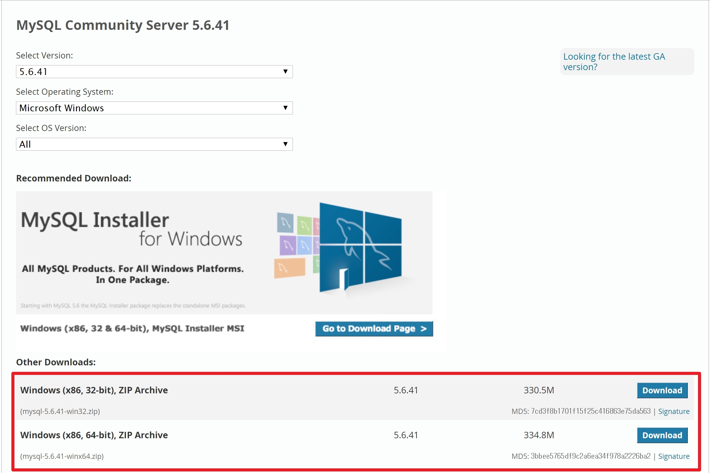
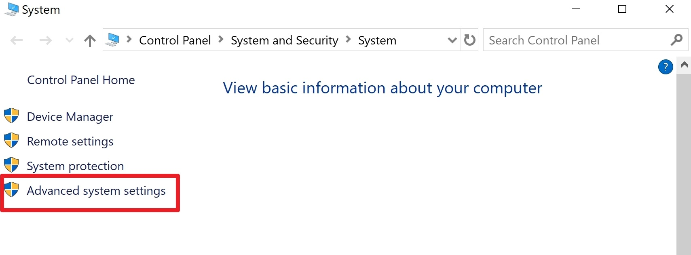
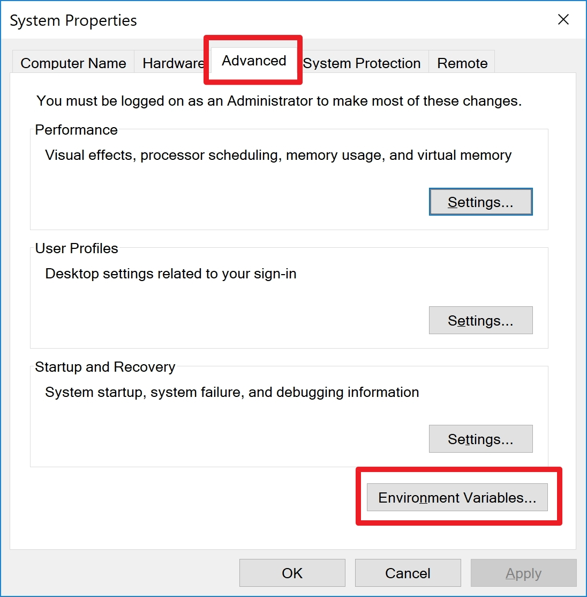
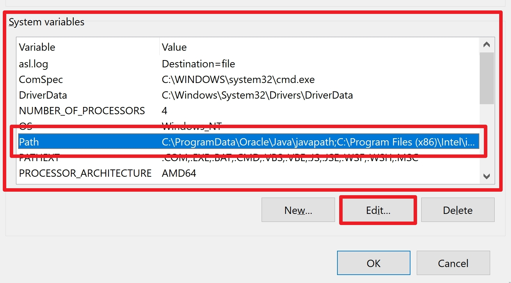
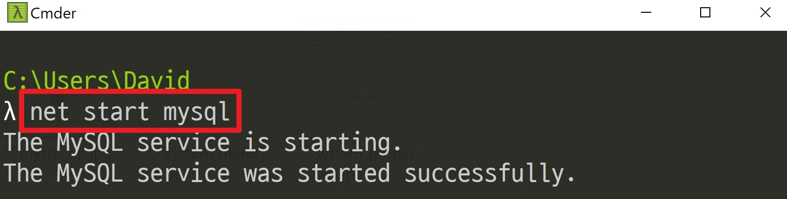
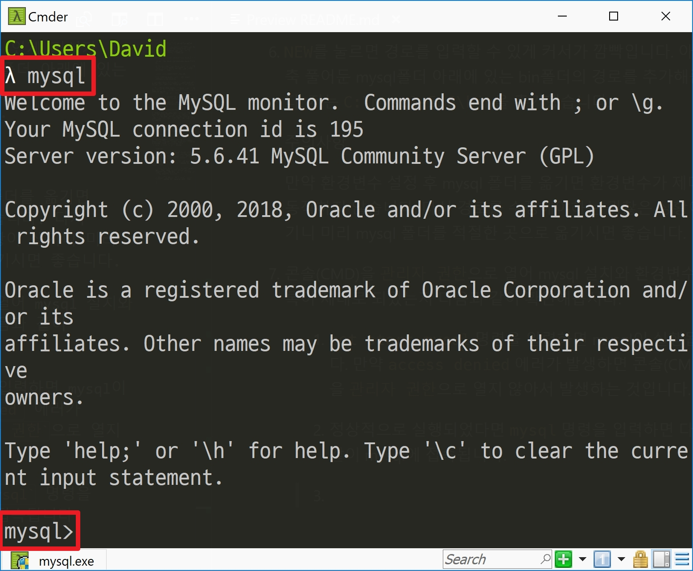
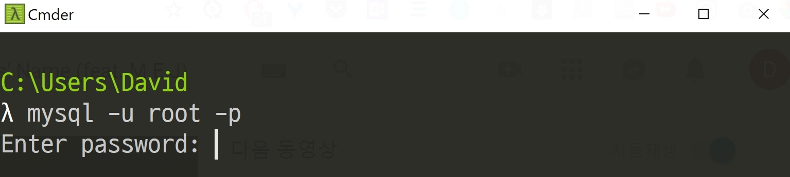

# Mysql 5.6 설치 윈도우10

1. 우선, Mysql 5.6 버전부터 다운받아야 합니다.

    쉬운 설치와 여러 플러그인을 제공하기 위해 Mysql Installer를 제공하지만 Installer를 통하여 설치했을 때 Character set 설정이 제대로 적용되지 않는 문제가 발생합니다.

    [https://dev.mysql.com/downloads/mysql/5.6.html](https://dev.mysql.com/downloads/mysql/5.6.html)

    위 링크로 들어가셔서 `Mysql Installer`가 아닌 `Mysql 5.6 zip`파일을 다운받으셔서 설치를 진행하시면 됩니다.

    

    본인 컴퓨터의 bit는 `내PC` 우클릭하시면 속성에서 볼 수 있습니다.

2. 다운받는 Mysql 5.6 zip파일을 적절한 곳에 압축을 풉니다. 저는 C드라이브 아래에 압축을 풀었습니다.

3. 콘솔(CMD)의 어느 곳에서든지 mysql을 실행할 수 있게 하려면 `환경변수`에 `mysql의 bin폴더 위치`를 등록해야 합니다.
    1. `내PC` 우클릭하여 `속성`을 선택합니다.

        `내PC`가 바탕화면에 없으신 분들은 `제어판`에서 `시스템`을 선택하시면 됩니다.

    2. 좌측 4번째 항목을 선택해주세요. 저는 영문 윈도우라서 `Advanced System Settings`이라고 되어 있습니다.

4. 시스템 속성 항목에서 저는 `Advanced`라고 표시되어 있지만 아마도 한글 윈도우에서는 `고급`이라고 표시되어 있을 겁니다. 해당 항목에 들어가셔서 `환경변수` 버튼을 눌러 환경변수 메뉴로 진입합니다.

5. 아래쪽 리스트에서 `PATH`를 찾아 선택한 후 `Edit` 또는 `편집`을 누릅니다.

6. `NEW`를 눌르면 경로를 입력할 수 있게 커서가 깜빡입니다. 아까 압축 풀어둔 mysql폴더 아래에 있는 bin폴더의 경로를 추가해줍니다. 저는 `C:\mysql-5.6\bin`을 추가했습니다.

    주의사항

    만약 환경변수 설정 후 mysql 폴더를 옮기면 환경변수가 제대로 동작하지 않습니다. 다시 경로를 수정해야하는 귀찮은 상황이 생기니 미리 mysql 폴더를 적절한 곳으로 옮기시면 좋습니다.

7. 콘솔(CMD)을 `관리자 권한`으로 열어 mysql 설치와 환경변수 등록이 제대로 되었는지 다음과 같이 확인해봅시다.

    1. `net start mysql` 명령을 입력하면 mysql이 실행됩니다. 만약 `access denied` 에러가 발생하면 콘솔(CMD)창을 `관리자 권한`으로 열지 않아서 발생하는 것입니다. 반대로 `net stop mysql` 명령을 입력하면 mysql 실행이 중지됩니다.

    1. 정상적으로 실행되었다면 `mysql` 명령을 입력하면 다음과 같이 mysql에 접속됩니다.

8. mysql에 접속한 상태에서 `exit` 명령을 내려 mysql에서 빠져나와 root 계정으로 다시 접속해보겠습니다. mysql을 빠져나왔다면 `mysql -u root -p`까지만 입력하시고 엔터치시면 password를 입력하라고 합니다. root 계정의 초기 비밀번호는 없습니다. 그냥 엔터 한 번 더 입력해주시면 mysql에 접속합니다.

