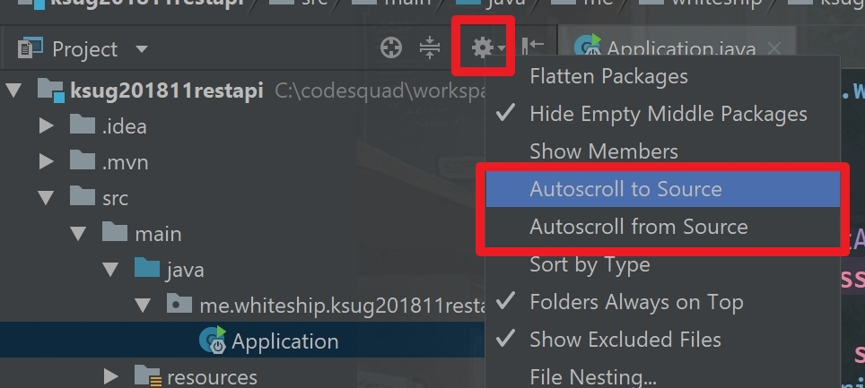

# 스프링 기반 REST API 개발

강연정보

* 강연자 : 백기선님
* 강연 슬라이드 : [링크](https://www.slideshare.net/whiteship/rest-api-development-with-spring)
* 소스코드 저장소 : [링크](https://github.com/keesun/study/tree/master/ksug201811restapi)
* 강연안내 : [링크](http://www.ksug.org/seminar/20181110)
* 일시&장소 : 2018.11.10 네이버 D2 스타트업 팩토리

## Session 1-2

deview 2017의 [그런 REST API로 괜찮은가](https://www.youtube.com/watch?v=RP_f5dMoHFc) 세션에서 감명받았다

#### 당부 말씀

* 내가 하는 코딩에 집착하지마라
* 각자의 상황과 환경에 맞는 방식으로 접근하라
* 내가 spring security를 이용해서 oauth로 로그인을 구현한다고 해서 꼭 spring security를 쓰는 게 아니라 각자의 언어나 개발환경에 따라 사용자 로그인이라는 목적을 달성하면 된다. 즉, **무엇을 하려는지 의도에 집중해라**

#### REST의 self-descriptive message란

* 메시지에서 주어진 것만으로 메시지의 내용을 모두 해석할 수 있어야 한다
* Content-Type:applicaion/json 은 기호들만 해석가능하고 키값은 해석할 수 없다. 그래서 self-descriptive 하지 않다
* json의 이런점을 어떻게 해결할 수 있나?
  * 방법1 : Media Type을 정의하자
  * 방법2 : Profile
    * 헤더의 링크에 profile relation을 링크할 수 있지만 일부 클라이언트(브라우저)에서 제대로 지원하지 못한다
    * 따라서 헤더의 link대신에 바디에 실어서 보낼 것이다
    * 그리고 HAL을 이용할 것이다
* HATEOAS : 하이퍼링크를 통해 상태가 전이
  * 데이터만 주고 링크가 없으면 HATEOAS가 맞는가? X
  * 데이터와 링크 둘 다 필요하다
* HATEOAS 링크 정보들은 상황에 따라 변해야 한다
  * 로그인 사용자에게는 게시글을 쓸 수 있는 링크를 준다
  * 로그인 하지 않은 사용자에게는 게시글을 쓸 수 있는 링크를 주지 않는다
* json의 링크에 해당 json에 대해 설명해놓은 profile link가 추가되어 있다

#### 롬복

* 롬복에서 equalsAndHashcode에서 of = id로만 한다
  * eqauls와 hashcode 자동생성될 때 기본값은 모든 필드를 가지고 생성한다
  * 이 때 순환참조가 발생할 수 있고, 이로인해 스택오버플로우가 발생한다
  * 그래서 생성될 때 비교 기준이 되는 것을 id로 제한한다
* 롬복에서 builder만 추가하면 디폴트 생성자가 생성되지 않아서 자바빈 규약에 따르는 클래스를 만들수 없다
* 따라서 디폴트 생성자를 생성하기 위해 AllArgsConstructor, NoArgsConstructor 애노테이션을 추가한다
* 롬복으로 생성한 코드는 테스트커버리지에 포함되지 않아서 테스트커버리지가 낮아진다
  * 아마존의 어떤 팀은 테스트 커버리지를 중요시 여기지만 롬복을 사용하고 있었다, 롬복때문에 테스트 커버리지가 낮게 나왔다
  * 이를 극복하기 위해 롬복으로 생성되는 게터, 세터 등의 코드를 테스트 커버리지에 포함시킬 수 있게 롬복을 커스텀해서 쓰고 있다
* Spring의 Meta Annotation
  * 롬복 구조상 지원하지 않는다
  * 지원하려면 구조를 갈아 엎어야 한다

* Intellij에서 현재 편집중인 파일을 IDE 좌측 패키지 탐색창에서 편집중인 파일이 선택되어 자동으로 따라다니게 만드려면 AutoScrollToSource/AutoScrollFromSource을 활성화시키자



#### Slice Test

계층(layer)별 테스트

* 스프링 부트 - 계층별 테스트 만드는 데 유용한 애노테이션
* 웹과 관련된 애들만 테스트하고 싶다면? WebMvcTest
* 이 때 웹과 관련된 빈만 등록되고 repository등 관련없는 빈들은 등록되지 않는다

* Created(201) 응답을 보낼 때에는 header의 location에 uri를 줘야 한다
  * HATEOAS가 제공하는 linkTo를 사용해서 uri를 만든다
* ObjectMapper를 주입받아서 Event객체를 String화해서 요청을 보낸다
* id를 Long이 아닌 Integer로 해도 21억개를 확보할 수 있다
* Event savedEvent = repository.save(event) 이후에 event 객체를 쓰면 제대로 동작하지 않는 경우가 있다, savedEvent를 이후에 써주는 게 좋다

``` java
// eventService
public Event example(Event event) {
    Event savedEvent = repository.save(event);
    //이후부터는 event 대신 저장한 뒤 리턴된 savedEvent 사용하기
}
```

* DTO를 도메인 객체로 복사
  * ModelMapper 의존성 추가하고 빈으로 등록하고 사용하기

``` java
Event event = modelMapper.map(eventDto, Event.class);
```

* SpringBootTest 애노테이션을 붙여도 mocking된 repository가 테스트에 있으면 mocking된 repository를 사용하기 때문에 null이 리턴될 수 있다
* Enum타입을 @Enumerate으로 매핑할 때 EnumType.ORDINAL보다 EnumType.STRING으로 맵핑하는 게 좋다
* validation 애노테이션으로 걸러낼 수 없는 경우 validator를 만들어서 검증한다

#### Validation

* domain validation - 입력 값이 DTO라면..?
* DTO에 대한 validator를 만든다
* 에러 발생 상황에 대한 테스트를 만들 때, 에러 발생하는 코드에 브레이크포인트 찍어두고 에러 객체를 까서(?) 뭐가 들었는지 보면서 테스트를 만든다

#### Erros

* Errors라는 객체는 자바빈 스펙을 준수하지 않는다
* 따라서 스프링의 빈 serializer가 json으로 변환해줄 수 없다
* 자바빈 스펙을 준수한다면 bean serializer가 json으로 바꿔준다
* 해결방법은 serializer를 만들어주자
  * @JsonComponent
  * EventSerializer라는 클래스는 `JsonSerializer<Errors>` 상속받아서 구현

#### 스프링 HATEOAS

* 리소스 - 데이터와 링크가 들어있다
  * 우리가 보낼 데이터(Event객체)를 Resource객체(spring hateoas)로 감싸야 한다
  * 데이터(Event객체)를 Resource에 넣고 데이터에 대한 링크도 추가하자
  * 링크 추가 방법
    * new Link("문자열")는 type safe하지 않다
    * linkTo는 type safe하다

#### 테스트

* Junit5에 테스트 이름을 다르게 적용하는 애노테이션이 있다
  * 테스트 목록에 메서드명 대신 애노테이션에 적용된 이름이 나온다
* Spring의 RESTdocs는 테스트를 가지고 문서를 만든다
  * json이 formatting 되지 않은 채 만들어진다
* RestDoc json formatting 방법
  * RestDocsMockMvcConfigurationCustomizer를 커스텀해서 빈으로 등록하자
* RequestFields 테스트할 때, 문서화 되지 않으면 실패를 띄운다
  * relaxedRequestFiels라고 relaxed를 붙이면 문서화하지 않는 것에 대해서 넘어간다

## Session 3-4

#### asciidoc

* asciidoc에 템플릿을 넣어주고 RestDoc으로 만들어진 snippets들을 asciidoc의 템플릿에 들어갈 수 있게 한다
* asciidoc tempate + snippets = docs.html
* maven-resouce plugin, 생성된 docs를 static 아래에 위치시켜준다
* 이 때 static디렉토리는 source쪽이 아니라 build쪽이다
* springboot는 classpath아래 static에 있는 것들을 정적파일로 제공한다

#### 테스트

* 테스트는 h2, 애플리케이션을 띄울 때에는 postgres를 사용하게 만들고 싶다면?
* `@DataJpaTest`가 적용된 테스트는 테스트 동작시 application.properties의 설정을 따르지 않고 h2를 쓴다
* 테스트를 위한 properties파일을 추가하려면 (intellij기준) test/resource 디렉토를 테스트 리소스 디렉토리로 등록해야 한다
* 그런데 source쪽 properties파일을 test쪽 propertiest가 덮어 쓴다
* 만약 test properties가 source쪽 properties를 완전 덮어쓰는 것을 방지하고 source쪽 properties의 일부만 덮어쓰려면 profile을 사용하자

#### HATEOAS

* PageResourceAssembler는 Page정보를 Resource로 바꿔준다
  * Assembler가 page의 데이터와 링크를 알아서 추가하는데, 링크는 first, prev, self, next, last가 추가된다

### Security를 위한 준비작업

#### 인증정보를 가진 상태에서 어떻게 HATEOAS를 변경할 것인가

* 스프링 시큐리티는 모든 요청을 기본적으로 block한다
* 인증 여부에 따라 HATEOAS의 링크정보가 달라질 수 있어야 한다
* UserDetails보다 스프링 시큐리티에서 구현해놓은 User를 사용하면 내가 신경써야 하는 부분이 적어진다
* 스프링 시큐리티는 서블릿필터가 모든 요청을 가로챈다. 이후 인증을 할지 말지, 서블릿 필터를 적용할지 말지를 판단한다

#### 시큐리티 구분

* 서블릿필터를 적용하지 않은 것
* 서블릿필터를 적용하되 로그인이 필요하지 않은 것
* 서블릿필터를 적용하되 로그인이 필요한 것

#### oauth 토큰 발급 받는 방법

* 대략 6가지 정도가 있음
* password-grant type은 서비스를 제공하는 입장에서만 사용해야 한다. 사용자의 password가 토큰에 입력되어야 하기 때문이다
* 생성자 주입을 받다가 순환참조가 발생하면 일단 autowired로 필드 주입을 받으면 순환참조는 끊킨다

#### 클라이언트 id,secret을 외부 설정파일로 빼는 방법

(넋놓고 보느라 기록을 못 했네요)

#### 응답으로 주는 json에 사용자의 password가 실려갈 때 어떻게 할 것인가

* serializer를 만들어 쓸거다
* AccountSerializer
* 주의 @JasonSerializer에서 faster를 import해줘야 한다

#### 오늘 한 것들

* 입력값제한
* Validation
  단순 validation
  로직 validation
* 에러 보낼 때 에러에 대한 데이터도 같이 보내는 것
* 페이지 정보도 Resource로 담아서 보내는 것
* 인증하고 인증걸고 현재 사용자에게 접근
* 현재 사용자 정보에 접근해서 hateoas 정보를 제한하는 방법

---

#### 피드백 및 감사

우선, 표를 양도해주셔서 좋은 기회를 제공해주신 [김도형](https://www.facebook.com/catharsis88)님께 진심으로 감사드립니다.

평소 유튜브나 인프런을 통해 백기선님 강의를 보고 있었지만 오프라인으로 진행되는 라이브코딩을 통해 가끔씩 터져나오는 에러를 해결하는 과정을 볼 수 있어 더욱 좋았습니다.

[2018 OKKYCON - The Real TDD](https://github.com/david-learner/java-study/tree/master/2018OKKYCON)가 끝난지 얼마되지 않은 이 시점에서 생각지도 못하게 REST API 개발을 TDD로 볼 수 있어서 여러 인사이트를 얻을 수 있었고 너무 좋았습니다. 시간이 부족한 관계로 모든 부분을 TDD로 하지 않으셨지만 나중에라도 강의가 올라온다면 TDD로 할 수 있는 부분을 TDD로 해주시면 학습하는 입장에서는 좋을 것 같다고 생각했습니다.

최대한 듣고 이해한 내용을 쓰려고 했지만 제가 부족한 관계로 의도와 다르게 기록된 부분이나 틀린 부분이 있을 수 있습니다. 잘못된 부분을 알려주시면 수정할 수 있도록 하겠습니다.

KSUG 일꾼단(운영진..?)분들께서 강연 진행의 모든 부분을 세심하게 챙겨주셔서 강연 듣는 데 전혀 불편함이 없었으며 좋은 강연을 제안해주신 백기선님께 감사드립니다.