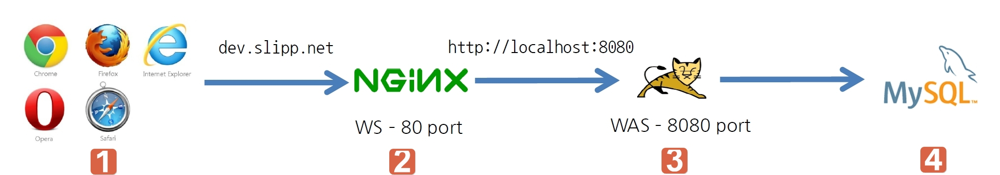
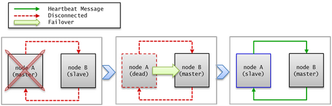
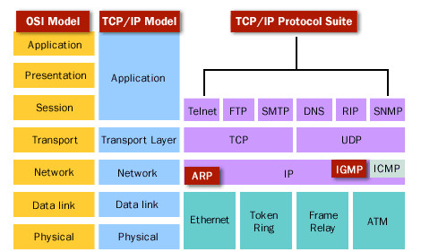
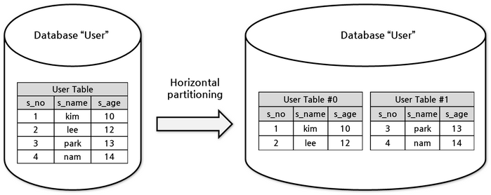
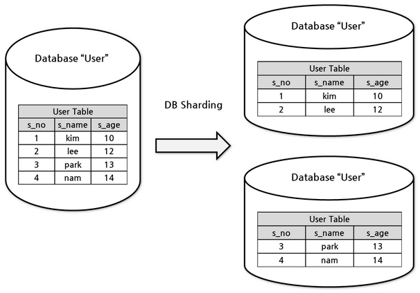
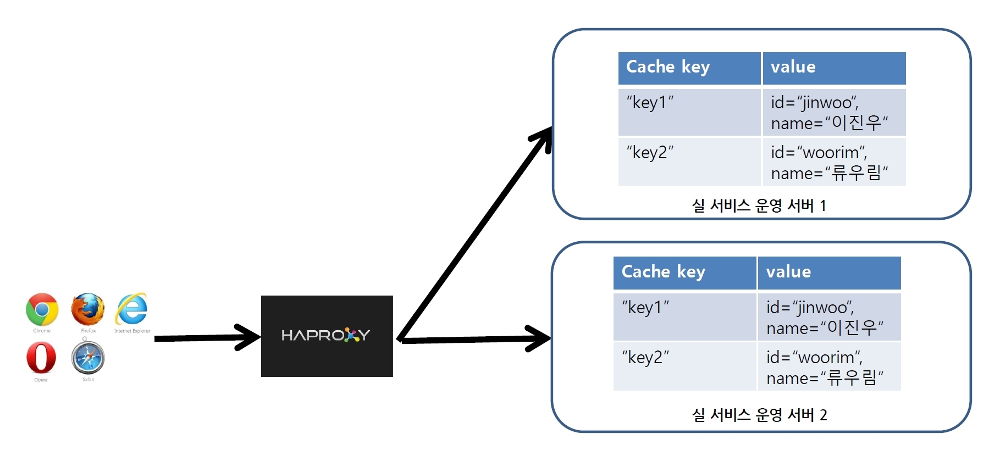
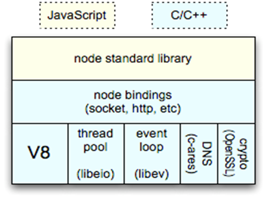
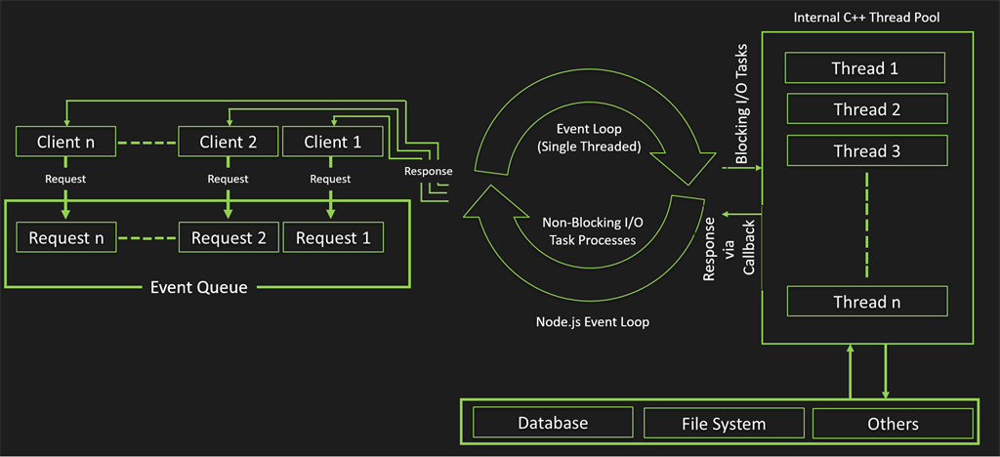
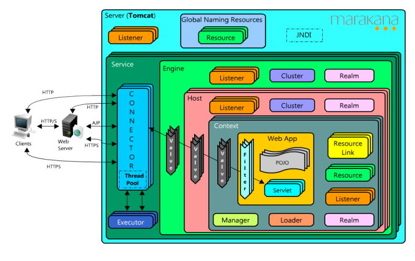
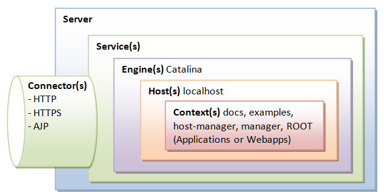

# 서버 추가를 통한 성능 향상
writer : learner

## Scalability(확장성)이란

비즈니스 요구에 맞게 시스템을 확장할 수 있는 용이성을 말한다.

* 수평적 확장을 기준으로 확장성 예시

    100명의 요청을 처리할 수 있는 서버 1대를 사용하고 있을 때, 1000명의 요청을 처리할 수 있게 서버를 n대로 확장시키기 쉬우면 확장성이 높은 것이고 그렇지 않으면 확장성이 낮은 것이다.

## Scale Up, Scale Out 각각의 장단점 및 차이점

ref : http://library.gabia.com/contents/infrahosting/1222

### Scale out

* 서버 대수를 늘려 처리 능력을 확장하는 것이다.
* 수평적 확장이라 말한다.
* 예시

    AWS에서 EC2 인스턴스를 1대만 가지고 서비스 중이다. 이 때, 더 많은 트래픽을 처리하기 위해 EC2 인스턴스를 2대 더 추가한다면 scale out에 해당한다.
* 장점
  * scale out 대비 성능 증가에 따른 비용이 적게 든다.
  * 1대의 서버에 장애가 생겨도 다른 서버에서 대신 요청을 처리할 수 있다.
  
* 단점
  * n대의 서버에 트래픽을 균등하게 배분하기 위해 `Load Balancer`와 같은 장비가 필요하다.
  * n대의 서버가 동일한 요청에 대해 일관된 응답을 하려면 모든 서버는 동일한 데이터를 가지고 있어야 한다. 따라서 n대의 서버는 데이터 동기화에 따른 오버헤드가 발생한다. (별도의 DB, Session 서버를 두지 않는 이상)

### Scale up

* 현재 운용중인 서버의 사양을 높여 처리 능력을 확장하는 것이다.
* 수직적 확장이라 말한다.
* 예시

    AWS에서 EC2 인스턴스를 1대만 가지고 서비스 중이다. 이 때, 더 많은 트래픽을 처리하기 위해 현재 운용중인 EC2 인스턴스의 사양(Cpu, RAM, SSD 등)을 업그레이드한다면 scale up에 해당한다.
* 장점
  * `Load Balancer`와 같은 별도의 트래픽 분배 장치를 둘 필요가 없다.
  * n대의 서버로 분리하는 것이 아니라 1대의 서버의 사양만 증가시키므로 분산처리에 대해 고민하지 않아도 되어 서버 구축이 용이하다.

* 단점
  * 장애 발생시 서비스가 중단될 수 있다.
  * sacle out 대비 확장 비용 증가폭이 크다.

## SPOF(Single Point of Failure) : 단일 장애점

* 시스템 구성 요소 중에서 동작하지 않으면 전체 시스템이 중단되는 요소
* 예시

  기상청의 웹 서버는 1대의 날씨 DB서버를 통해 날씨 정보를 사용자들에게 알려준다. 이 때 날씨 DB서버가 고장나면 웹 서버는 사용자가 요청하는 날짜에 대한 날씨를 제공하지 못하므로 시스템이 중단된다.

* 서버 구조상 이중화 되지 않은 곳은 SPOF가 발생할 수 있다.

## SPOF 발생 지점 찾기

ref : pobi

* 2번, WS(NGINX)
* 3번, WAS(Tomcat)
* 4번, DB(MySql)
* 1번과 2번 사이, Router - 외부망과 연결되는 지점인데 라우터가 고장나면 외부로부터 오는 요청을 서버에서 받을 수 없다.

## SPOF 이슈 해결 방법

* SPOF가 일어나는 모든 지점을 이중화한다.
* Failover를 통해 장애가 일어난 서버가 자동으로 대기 서버로 전환되어 서비스가 정상동작되게 한다.

### Failover

* 장애발생시 대기중인 서버를 운영서버로 전환하는 것

### Failback

* 장애발생한 서버가 운영서버에서 제외되고, 장애 복구된 다음 다시 서비스 그룹에 포함되는 것
* 아래 그림을 보면 죽었던 node A가 master가 아닌 slave로 서비스 그룹에 포함된 것을 볼 수 있다.

ref : https://www.cubrid.org/manual/ko/9.1.0/ha.html

## Load Balancing

### Load Balancing

* 부하 분산을 위해서 가상(virtual) IP를 통해 여러 서버에 접속하도록 분배하는 기능이다.

### Load Balancer

* n대의 서버에게 균등하게 트래픽을 분산시키는 행위를 하는 장비(H/W, S/W)
* H/W로는 L4스위치, L7스위치 등이 있다.
* S/W로는 HAProxy가 있다.

### L4, L7의 역할 및 차이점

* L4
  * Transport Layer에서 TCP/UDP의 포트를 기준으로 패킷을 구분하여 서버에 전송한다.
  * IP주소가 동일하여도 포트가 다르면 패킷을 서로 다른 서버에 보낼 수 있다.

* L7
  * IP주소, TCP/UDP port정보, 패킷 내용까지 참조하여 각 패킷을 서로 다른 서버에 전송할 수 있다.

* 차이점
  
    L4와 L7 스위치 모두 로드밸런싱이라는 핵심기능을 가지고 있지만 커버하는 Layer 특성상(L4는 Layer4까지, L7은 Layer7까지) L4보다 L7 스위치가 더 많은 정보를 바탕으로 정교한 로드밸런싱이 가능하다.

### HAProxy

* 기존 하드웨어 스위치를 대체하는 소프트웨어 로드밸런서다.
* 네트워크 스위치에서 제공되는 L4, L7 기능 및 로드밸런서 기능을 제공한다.

### Proxy Server

* **proxy server**는 실서버와 클라이언트 사이를 중계해주는 역할을 하는 서버다. 이 때 중계기로서 대신 요청을 주고 받는 기능을 proxy라고 한다.

* **forward proxy**
  * 클라이언트의 요청을 받아 단순히 요청하는 곳으로 중계하는 역할
  * 단, 클라이언트는 외부 서버에 대해 요청을 보낼 때 forward proxy server로 요청을 보내게 되어 있어야 한다.
* **reverse proxy**
  * 외부에서 직접적으로 접근하지 못하는 서버 자원을 대신 요청하여 중계하는 역할
  * revere proxy server뒤에서 실제 자원을 제공하는 서버는 별도로 있지만, 마치 reverse proxy server가 제공하는 것처럼 보여진다.

## Database

### master/slave 구조

* 하나의 DB에 부하가 몰리는 것을 방지하며 Master의 내용을 slave에 복제하여 백업 기능을 가지는 구조다.

* 일반적으로 master DB에 insert/update/delete가 수행되며 slave에는 select 쿼리가 수행된다.

### Sharding

* sharding에 앞서 partioning에 대해 알아보자. **partioning**(이하 분할)이란 퍼포먼스(performance), 가용성(availability) 또는 정비용이성(maintainability)을 목적으로 데이터들을 다수의 테이블로 쪼개는 행위다.

* partioning에는 Column별로 쪼개는 수직 분할과 record별로 쪼개는 수평 분할이 있다.

* 수평 파티셔닝은 sharding과 비슷해보이지만 일반적으로 하나의 DB내에서 record를 기준으로 table을 분리한다. 이로인해 각 테이블의 크기가 감소하고 인덱스의 크기가 감소하므로 성능 향상을 기대할 수 있다.

ref : https://www.cubrid.org/manual/ko/9.3.0/shard.html

* **sharding**이란 물리적으로 다른 데이터베이스에 데이터를 수평 분할방식으로 분산 저장하는 것이다. sharding의 경우 성능상 이유뿐 아니라 하나의 데이터베이스 인스턴스에 담지 못하는 큰 데이터를 분산하여 처리하기 위해 사용한다.

ref : https://www.cubrid.org/manual/ko/9.3.0/shard.html

## N대의 서버 Session 이슈

ref : pobi

* Quiz : 사용자가 1번 서버에 로그인 요청을 보내 로그인 하면 sessionId가 "abc"란 이름으로 서버에 session이 생성된다. 로그인을 완료한 후 다음 요청에 대해 Load Balancer가 1번 서버가 아닌 2번 서버로 요청을 보낸다면 어떻게 될까?

  * 2번 서버의 세션 테이블에도 동일한 사용자에 대한 sessionId가 등록된다. 즉, 1번 서버의 세션 테이블과 중복되는 것이다.

* 서버가 1대에서 n대로 증가하는 경우 발생하는 session 이슈를 해결할 수 있는 방법은?

  * n대의 서버가 서로 session table을 동기화하여 동일한 상태를 유지한다. (session clustering)
  * 별도의 session 서버를 두어 관리한다.
  * 운영 서버 앞단에 로드밸런서를 두고 sticky session을 이용하여 정해진 서버로 보낸다.

* **sticky session**

  * 사용자 요청에 대한 응답을 보낼 때, cookie에 해당 서버에 대한 정보를 담아서 다음 요청 때 로드밸런서가 cookie에 저장된 서버 정보를 통해 동일한 서버에 사용자가 연결되게 하는 기술

* **session clustering**

  * n대의 서버가 서로 세션 정보를 공유하여 모든 서버 해당 사용자를 인식하고 요청을 처리할 수 있다.

  * tomcat의 경우 multicast 방식으로 session 정보를 전파하는 session clustering도 지원한다.

* session server
  
  * n대의 서버가 세션을 참조하기 위한 서버
  * n대의 서버가 세션 정보를 위해 빈번하게 접근하므로 redis와 같은 in-memory 기반의 데이터 저장소가 쓰인다.

## N대의 서버 Cache 이슈

ref : pobi

* 현재 자신이 구현하고 있는 서비스 중에서 cache를 적용하면 좋은 데이터가 있다면 무엇인가?
  * 자주 변경되지 않는 static file들(html, css, js, image 등)
  * 페이스북의 경우 첫 화면에 보여줄 피드 일부(검증X)

* n대의 서버에서 중복 관리되는 cache 데이터를 효과적으로 관리하기 위한 방법은?
  * 캐시 데이터만 관리하는 별도의 캐시 서버를 구축한다.

* Memcached 또는 redis를 활용한 cache 적용 전략은?
  * 만약 cache 서버가 1대라면 자주 사용되는 데이터 위주로 cache를 적용한다.
  * cache 서버가 2대 이상이라면 ?
  1. range, 범위로 구분하여 데이터를 분산하여 cache를 적용한다. 범위가 너무 크면 cache 서버별 사용 리소스가 크게 차이날 수 있다. 예를 들어 1번 서버 range에 속하는 데이터가 집중 cache hit되면 1번 서버 사용 리소스가 높아지는 것이다.
  2. consistent hashing, 애초에 웹 캐시를 위해 고안된 방법이다. 자세한 방법은 [링크](https://www.joinc.co.kr/w/man/12/hash/consistent)
  3. indexed, 캐싱된 데이터가 어디있는지 index해둔 서버를 별도로 구축하는 방법

## Node.js VS tomcat

### Node.js

* Node.js는 single thread 기반으로 동작하는 고성능 비동기 IO(Async / Non-blocking IO)를 지원하는 네트워크 서버이다.

* event 기반 프로그래밍 모델을 사용하고 있다.

* Javascript 기반이고 개발구조가 단순화되어 있어 빠르게 개발이 가능하다. FrontEnd(FE) 개발자 입장에서는 Javascript로 BackEnd(BE) 개발이 가능하다보니 굳이 백엔드를 위해 Javascript를 다루지 않는 엔지니어를 뽑을 필요 없으며 성능상의 이점보다 Learning Cruve나 조직내 FE/BE 기술통합의 이점을 더 크게 생각할 수 있다.

### single thread 기반인 Node.js의 동작방식은?

* Node.js는 V8 Javascript 엔진을 기본으로 동작한다. 구글의 chrome 브라우저에서 사용된다.

* Node.js가 사용자 요청을 처리하는 내부 동작은 위 그림과 같다.
1. 사용자 요청은 Node.js의 **event Queue**에 들어간다.
2. single thread로 동작하는 **event loop**는 event queue에서 요청을 하나 꺼내어 처리한다.
3. 이 때, DB, File IO와 같이 **blocking IO**가 발생하는 일들은 내부의 **thread pool**에 있는 하나의 thread에 위임한다. 즉, 내부적으로는 node.js도 multi thread를 활용하는 것이다. 만약 내부적으로 multi thread를 이용하지 않는다면 blocking IO가 필요한 요청이 올 때마다 event loop는 해당 요청을 처리하기 위해 잠시 멈추어야 한다. sinlge thread의 빠른 처리 이점이 사라지는 것이다.
4. 처리된 결과는 다시 사용자에게 응답으로 반환된다.

### multi thread 기반인 Tomcat의 동작방식은?

* tomcat의 내부는 위의 그림과 같다.
* 사용자의 요청이 서버에 도달하면, socket을 추상화시킨 HTTP Connector를 통해 사용자의 요청이 웹 애플리케이션까지 도달한다.
* Conncetor들은 Thread Pool에서 관리되며, 한 사용자의 요청은 하나의 Connector가 담당한다. 동시다발적으로 다수의 사용자가 요청을 보내면 다수의 Connector가 사용자의 요청을 처리한다.
* A라는 connector가 사용자B의 요청을 처리하고, 사용자B에게 보낼 응답까지 담당한다.
* Connetor는 tomcat 서버 시작시 최소 개수를 정할 수 있으며, 필요하면 지정한 최대 개수만큼 Connector를 생성할 수 있다. 사용량이 적어져 사용자의 요청을 처리하지 않는 connector들은 idle 상태로 전환되며 최소 개수까지 줄어들 수 있다. 이는 모두 tomcat 서버에서 세팅이 가능하다.

### 각 서버의 장단점을 비교하고 사용하기 적합한 방식은?

* single thread 기반 nodejs는 CPU 작업이 많은 웹 애플리케이션에서는 사용을 자제해야 한다. blocking io function을 사용하는 작업은 내부의 multi thread에 맡기지만 그게 아닌 작업들은 single thread로 처리한다. 이 때 CPU 사용이 많은 하나의 요청을 처리하는 데 작업 시간이 길어질테고, 뒤에 다른 요청들이 지연될 것이다. 그러나 websocket.io을 이용한 채팅서비스를 비교적 쉽게 만들 수 있거나 Single Page App 개발에 적합하다.

* multi thread 기반 tomcat은 대규모의 사용자 요청과 로직의 복잡도가 높아 CPU 사용률이 높은 작업의 경우 tomcat을 사용하면 좋다. 다만, thread pool에서 대기중인 connector들이 즉각적으로 요청 처리 후 사라지는 게 아니라 비교적 자원낭비가 있을 수 있다.

## Cache
cache란 빈번히 사용되는 데이터를 특정 장소(일반적으로 읽기 속도가 더 빠른 저장장치)에 복사해두어 데이터 요청에 대해 더 빠른 응답을 할 수 있게 하는 기술

### 어떤 성격의 데이터를 cache하는 것이 적합한가?
* 변화가 적은 static file들
  * image, css, js 등
* 게시판의 최신 글들
  * 보통 게시판을 접속하면 사용자들이 처음보는 화면은 최신 게시글들 이기 때문에

### 캐시 교체 알고리즘인 FIFO, LRU, LFU 는 무엇이며 어느 경우에 적합한가?

아래의 알고리즘들은 효율적인 캐시 데이터 저장공간 운용을 위해 캐시 데이터를 삭제할 때 어떤 데이터를 삭제할지 고르는 기준이 된다.

* FIFO (First In First Out)
  * 먼저 저장되었던 순서대로 데이터를 교체한다. 제일 먼저 저장되었던 캐시 데이터가 제일 먼저 교체된다.
  * FIFO는 상대적으로 매우 단순한 구조를 가진다. 비교적 복잡한 캐시 교체 알고리즘 연산을 수행할만큼 자원이 허락하지 않는다면 FIFO 알고리즘 사용을 고려할 수 있다. 일관된 순서를 유지하며 데이터를 사용할 경우 효율적이다.

* LRU (Least Recently Used)
  * 가장 오래 사용되지 않은 데이터를 교체한다. 일반적인 상황에서 가장 효율이 좋은 알고리즘.

* LFU (Least Frequently Used)
  * 가장 적게 사용된 데이터를 교체한다. 몇 번 사용되었는지 count 해줘야 한다.

### 참고
https://docs.microsoft.com/ko-kr/biztalk/core/what-is-scalability
http://www.ktword.co.kr/abbr_view.php?m_temp1=868
http://library.gabia.com/contents/infrahosting/1222
http://idchowto.com/?p=29915
https://m.blog.naver.com/PostView.nhn?blogId=islove8587&logNo=220548900044&proxyReferer=https%3A%2F%2Fwww.google.co.kr%2F
http://www.thisisgame.com/webzine/news/nboard/4/?n=54955
https://www.slideshare.net/heungrae_kim/14-jco-by-javacafe?qid=0b505c3f-9f9e-4392-9484-4eee1c72ea19&v=&b=&from_search=2
https://www.cubrid.org/manual/ko/9.1.0/ha.html
http://klero.tistory.com/entry/L2-L3-L4-L7-%EC%8A%A4%EC%9C%84%EC%B9%98-%EA%B5%AC%EB%B6%84-%EB%B0%8F-%EA%B8%B0%EB%B3%B8%EC%A0%81%EC%9D%B8-%EC%84%A4%EB%AA%85
https://www.freeism.co.kr/wp/archives/698
https://sarc.io/index.php/miscellaneous/758-osi-7-l4-l7
http://soul0.tistory.com/140
https://d2.naver.com/helloworld/284659
https://ko.wikipedia.org/wiki/%ED%94%84%EB%A1%9D%EC%8B%9C_%EC%84%9C%EB%B2%84
http://happymemoryies.tistory.com/13
http://idess.tistory.com/6
https://code.i-harness.com/ko/q/36d98
http://httpd.apache.org/docs/2.4/mod/mod_proxy.html#page-header

* db

  * https://www.xpressengine.com/forum/20657238
  * http://theeye.pe.kr/archives/1917
  * https://www.cubrid.org/manual/ko/9.3.0/shard.html

* session
  * http://bcho.tistory.com/794
  * http://12bme.tistory.com/196

* cache
  * https://charsyam.wordpress.com/2016/07/27/%EC%9E%85-%EA%B0%9C%EB%B0%9C-%EC%99%9C-cache%EB%A5%BC-%EC%82%AC%EC%9A%A9%ED%95%98%EB%8A%94%EA%B0%80/
  * http://ojava.tistory.com/70
  * https://www.joinc.co.kr/w/man/12/hash/consistent
  * https://www.slideshare.net/OnGameServer/ss-10451675

* Nodejs, Tomcat
  * https://developers.google.com/v8/
  * http://bcho.tistory.com/881
  * http://windowx.tistory.com/entry/apache-tomcat-diagram
  * http://linux.systemv.pe.kr/tomcat-7-%EA%B5%AC%EC%A1%B0/
  * https://www.slideshare.net/jieunsys/ss-56543446
  * http://jang8584.tistory.com/14
  * https://tomcat.apache.org/tomcat-6.0-doc/config/executor.html
  * http://ttlnews.blogspot.com/2016/02/tomcat-7-request-processing-threading.html

* Cache
  * https://ko.wikipedia.org/wiki/%EC%BA%90%EC%8B%9C
  * http://onecellboy.tistory.com/260
  * https://github.com/clojure/core.cache/wiki/FIFO
  * 