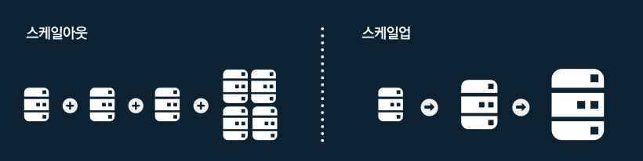

# 서버 추가를 통한 성능 향상

## Scalability(확장성)이란

비즈니스 요구에 맞게 시스템을 확장할 수 있는 용이성을 말한다.

수평적 확장을 기준으로 확장성 예시
    기준으로 100명의 요청을 처리할 수 있는 서버 1대를 사용하고 있을 때, 1000명의 요청을 처리할 수 있게 서버를 n대로 확장시키기 쉬우면 확장성이 높은 것이고 그렇지 않으면 확장성이 낮은 것이다.

## Scale Up, Scale Out 각각의 장단점 및 차이점

ref : http://library.gabia.com/contents/infrahosting/1222

### Scale up

### Scale out

### 참고
https://docs.microsoft.com/ko-kr/biztalk/core/what-is-scalability
http://www.ktword.co.kr/abbr_view.php?m_temp1=868
http://library.gabia.com/contents/infrahosting/1222
http://idchowto.com/?p=29915