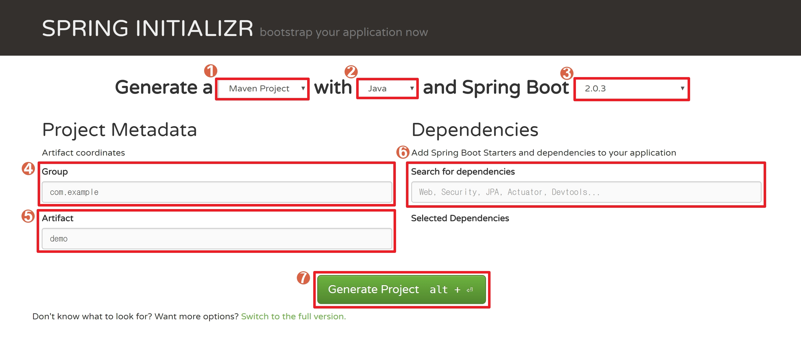
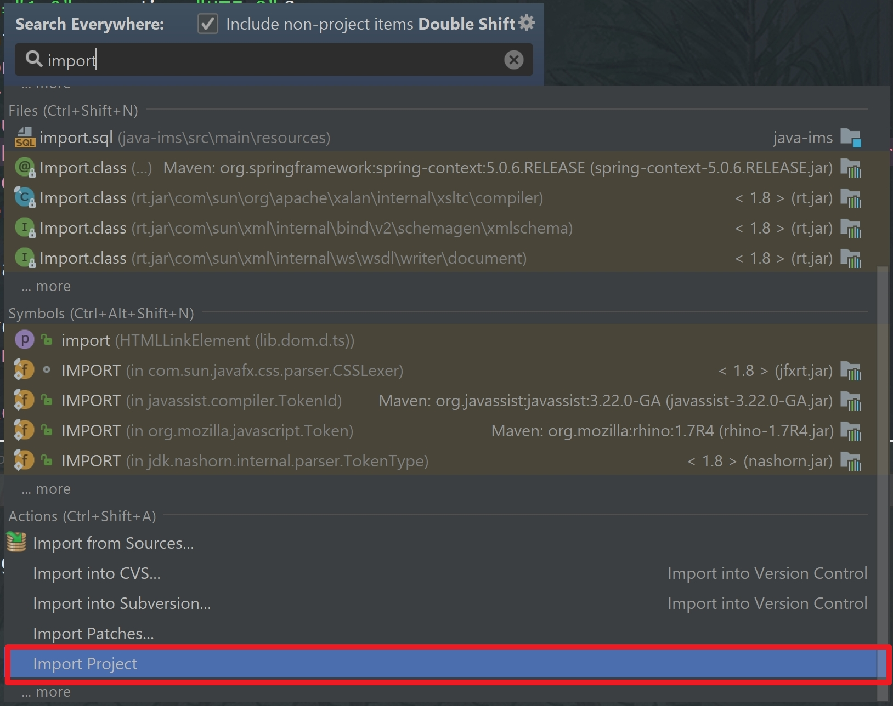
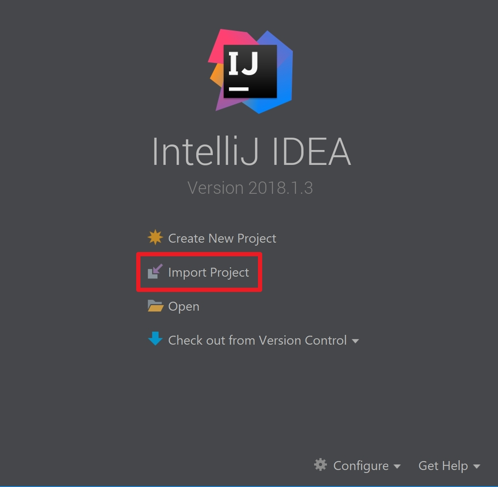
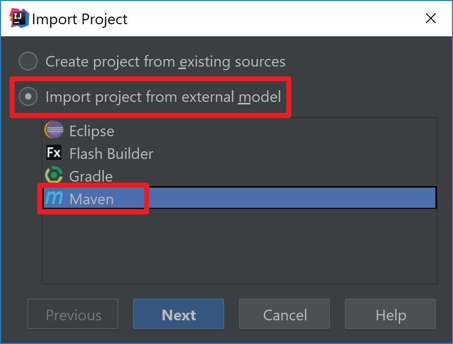
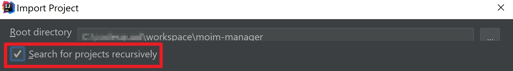
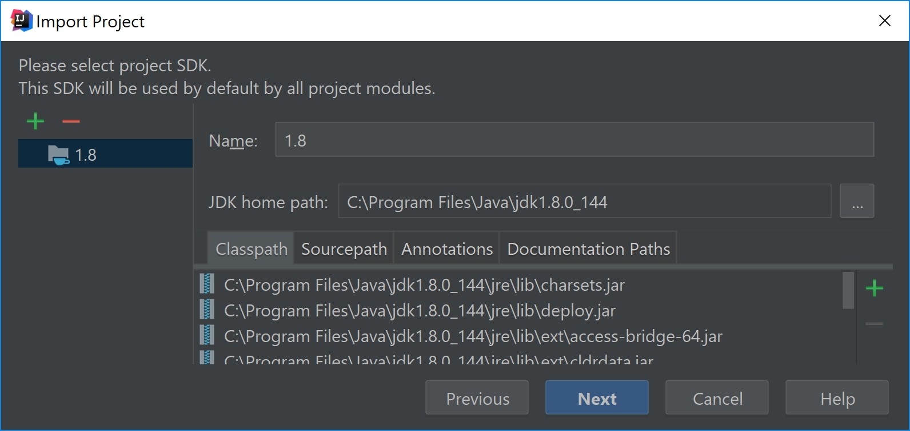
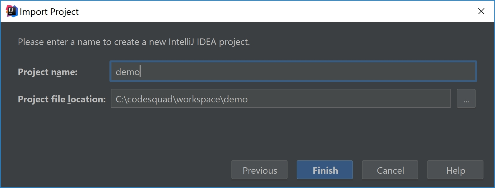

# 스프링부트 프로젝트 생성하는 방법 (인텔리제이)

1. [https://start.spring.io](https://start.spring.io) 에 접속한다.

   
2. (1) - 빌드도구

   (2) - 사용할 언어

   (3) - 사용할 Spring boot 버전

3. Project Meta Data : 프로젝트 설명

   (4) - Group : 프로젝트 패키지가 지정하는 이름으로 생성된다.

   (5) - Artifact : 프로젝트 폴더 이름이 지정하는 이름으로 생성된다.

4. Dependencies

    (6) - 의존성 추가 : 필요한 라이브러리들을 추가할 수 있다.

    여기서 지정하면 자동으로 빌드도구들의 설정에 추가된다.

5. Generate Project를 누르면 내가 설정한 것에 맞게 세팅된 프로젝트가 다운받아 진다.

6. 다운받은 프로젝트 압축파일를 자신만의 작업폴더에 압축을 풀어준다.

7. IntelliJ라면 shift를 연속으로 2번 눌러 검색창을 띄우고 `import`라고 검색하면 다음과 같이 제일 마지막에 `import project`라고 나온다.

    

    또는 IntelliJ 초기화면에서도 import project를 선택해도 된다.

    

8. 이전에 압축을 풀어둔 프로젝트 폴더를 선택한다.

9. Import Project from external model을 선택하고 프로젝트 생성시 선택했던 빌드도구를 선택한다.

    나는 Maven이었으므로 Maven을 선택했다.

    

10. Search for projects recursively에 체크한다. 빌드도구 설정파일을 찾는 것이다. maven의 경우 pom.xml을 찾게 된다.

    

11. 기본적으로 체크되어 있을 것이다. 만약 체크되어있지 않으면 체크해주고 넘어가자.

    

12. JDK를 선택한다. 등록된 JDK가 없으면 +를 눌러 JDK를 추가해주자. JDK가 설치된 경로만 설정해주면 알아서 추가된다.

    

13. 프로젝트 이름을 설정한다. start.spring.io에서 프로젝트 생성시 Artifact 항목에 기재한 것이 그대로 반영된다.

    

14. 초기 구동시 각종 의존성 패키지를 받아오느라 시간이 조금 걸린다.