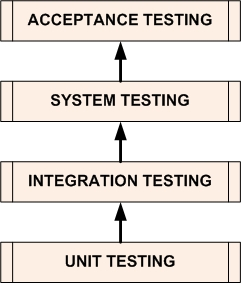

# 챕터2 테스트

145p

- 스프링이란

    IoC/DI를 이용해 객체지향 프로그래밍 언어의 근본과 가치를 손쉽게 적용, 사용할 수 게 돕는 기술

    복잡한 엔터프라이즈 애플리케이션을 효과적으로 개발하기 위한 기술

149p

- 작은 단위의 테스트
    - 한꺼번에 너무 많은 것을 몰아서 테스트하면 테스트 수행 과정도 복잡해지고 오류가 발생했을 때 정확한 원인을 찾기가 힘들어진다
    - 테스트는 가능하면 작은 단위로 쪼개서 집중해서 할 수 있어야 한다
    - 관심사의 분리, 테스트의 관심이 다르다면 테스트할 대상을 분리하고 집중해서 접근해야 한다

- 단위 테스트(unit test)
    - 150p, 왜 단위 테스트를 하는가? 코드가 원래 의도한 대로 동작하는지 빨리 확인받기 위해서(feedback)
    - 작은 단위의 코드에 대해 테스트를 수행하는 것
    - 여기서 `단위`는 크기와 범위가 정해져있지 않다
    - 크게보면 사용자 관리 기능을 모두 통틀어서 하나의 단위로 볼 수 있고, 작게 보자면 메소드 하나만 가지고 하나의 단위라고 생각할 수 있다

    > 메소드를 하나의 관심으로 보려면 메소드 또한 관심사의 분리가 잘 이루어져야 한다

- 통합 테스트(integration test)

테스트 종류와 목적

[http://softwaretestingfundamentals.com/software-testing-levels/](http://softwaretestingfundamentals.com/software-testing-levels/)

테스트 도구

[https://www.oss.kr/info_test/show/b3f50bf5-7d67-486f-bc70-d426d6f01dc4](https://www.oss.kr/info_test/show/b3f50bf5-7d67-486f-bc70-d426d6f01dc4)

151p

- 자동화된 테스트
    - 테스트는 자동으로 수행되도록 코드로 만들어지는 것이 중요하다
    - 테스트를 잘 짰다는 가정하에 자동화된 테스트는 사람의 책임이 낮아지고 테스트의 책임이 높아진다

156p

- 새로 도입한 기술의 적용에 문제가 없는지 확인할 수 있는 가장 좋은 방법은 빠르게 실행 가능하고 스스로 테스트 수행과 기대하는 결과에 대한 확인까지 해주는 코드로 된 자동화된 테스트를 만들어 두는 것이다

168p

- 테스트를 안 만드는 것도 위험한 일이지만, 성의 없이 테스트를 만드는 바람에 문제가 있는 코드인데도 테스트가 성공하게 만드는 건 더 위험하다

175p

- 개발자는 머릿속으로 이 코드가 잘 돌아가는 케이스를 상상하면서 코드를 만드는 경우가 일반적이다
- 스프링의 창시자인 로드존슨은 "항상 네거티브 테스트를 먼저 만들라"는 조언을 했다
- 테스트를 작성할 때 부정적인 케이스를 먼저 만드는 습관을 들이는 게 좋다

> 만약 테스트 초보자라면 우선 긍정적인 케이스를 만들고 테스트를 만드는 것에 익숙해지면 부정적인 케이스를 먼저 만드는 습관을 들이는 것도 좋은 방법인 것 같다

177p

- TDD에서는 테스트를 작성하고 이를 성공시키는 코드를 만드는 작업의 주기를 가능한 한 짧게 가져가도록 권장한다

188p

@Autowired

- @Autowired가 붙은 인스턴스 변수와 일치하는 컨텍스트 내의 빈을 찾는다.
- 타입이 일치하는 빈이 있으면 인스턴스 변수에 주입해준다
- 동일타입으로 선언된 빈이 2개 이상이면 빈의 이름과 변수의 이름이 동일한 것을 찾아 주입해준다 (우선순위 : 타입, 이름)

190p

- AOP

    새로운 기능을 넣기 위해 기존 코드는 전혀 수정할 필요 없다

    추가했던 기능이 필요없어지면 언제든지 간단한 수정으로 제거할 수 있다

    이러한 기법을 일반화 한 것이 AOP다

192p

- @DirtiesContext

    테스트 시 애플리케이션 컨텍스트를 새롭게 생성해줘야 하는 경우는 언제인가?

196p

- 스프링 컨테이너 없이 테스트할 수 있는 방법을 가장 우선적으로 고려하자, 테스트 수행 속도가 가장 빠르고 테스트 자체가 간결하다
- 여러 오브젝트와 복잡한 의존관계를 갖고 있는 오브젝트를 테스트해야 할 경우가 있다. 이때는 스프링의 설정을 이용한 DI 방식의 테스트를 이용하면 편리하다
- 테스트 설정을 따로 만들었다고 하더라도 때로는 예외적인 의존관계를 강제로 구성해서 테스트해야 할 경우가 있다. 이때는 컨텍스트에서 DI 받은 오브젝트에 다시 테스트 코드로 수동 DI 해서 테스트하는 방법을 사용하면 된다. 꼭 @DritestContext 붙이기

197p

학습 테스트의 목적

- 테스트를 만들려고 하는 기술이나 기능에 대해 얼마나 제대로 이해하고 있는지
- 그 사용 방법을 바로 알고 있는지
- 빠르고 정확하게 사용법을 익히는 것