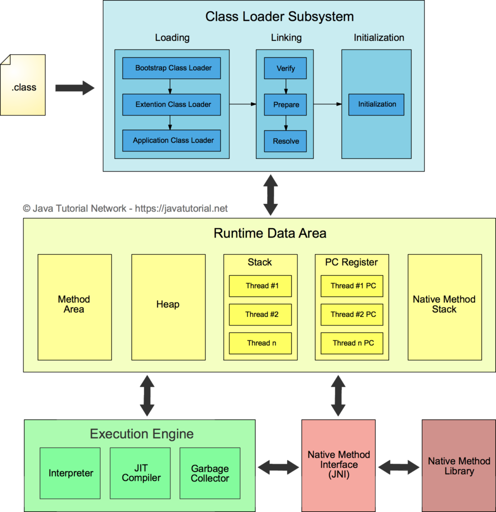
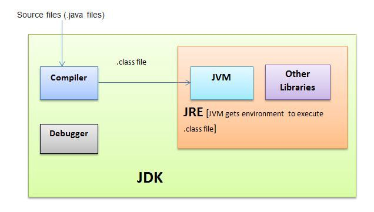
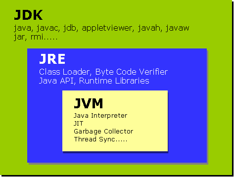

# 토비의 스프링 챕터 3 템플릿

209p, 개방 폐쇄 원칙(OCP)

* 확장에는 열려 있고 변경에는 닫혀 있는 객체지향 설계의 원칙

템플릿

* 변경이 거의 일어나지 않으며 일정판 패턴으로 유지되는 특성을 가진 부분을 독립시켜서 효과적으로 활용할 수있도록 하는 방법

227p, 내부 클래스

* 특정 메소드에서만 사용되며, 메소드 로직에 강하게 결합되어 있다면 메소드 내에 로컬 클래스로 만들어 사용할 수 있다

234p

* 스프링 빈의 설정은 클래스 레벨이 아니라 런타임 시에 만들어지는 오브젝트 레벨의 의존관계에 따라 정의된다

236p, DI 와 IoC의 차이

* 의존관계 주입(DI)이라는 개념을 충실히 따르자면, 인터페이스를 사이에 둬서 클래스 레벨에서 의존관계가 고정되지 않게 하고, 런타임 시에 의존할 오브젝트와의 관계를 다이내믹하게 주입해주는 것이 맞다

* 그러나 스프링의 DI는 넓게보자면 객체의 생성과 관계설정에 대한 제어권한을 오브젝트에서 제거하고 외부로 위임했다는 IoC라는 개념을 포괄한다

* DI는 IoC의 수많은 기법 중 하나다
* IoC를 구현하는 많은 방법 중에 DI가 포함된다
* 질문, DI 하나만으로 IoC를 구현했다고 할 수 있는가? 자답하자면, No 아니다. 왜냐하면 IoC를 적용하면 오브젝트는 스스로가 어디서 만들어져서 어떻게 이용되는지 몰라야 한다. 이는 DI로만 할 수 없고 Container의 개념이 필요하다. Container에 내가 등록되어 있어야 하고, 의존관계 설정 정보에 따라 런타임에 오브젝트 간 의존관계가 맺어지기 때문이다

Dependency Injection VS Dependency Inversion

getClass().getResource("resourceName")
* 패키지에 경로에 있는 resourceName에 해당하는 파일의 URL을 불러온다
* URL과 Path 차이는?

ClassPath
* JVM이 프로그램을 실행할 때 클래스 파일을 찾는 데 기준이 되는 파일 경로들.

* 서버에서의 classPath, 로컬에서의 classPath
* 별도로 지정해줄 수 있다
* 아무런 classpath가 없다면, 

ClassLoader
* JVM안에서 동적으로 자바 클래스들을 로딩하는 JRE의 한 부분
* 런타임에 클래스를 읽어올 수 있게 하는 기술
* 왜 동적 로딩(런타임에 클래스를 읽어오는 것)이 중요한가? http://soul0.tistory.com/421
* 자바 프로그램은 한 개 혹은 그 이상의 클래스들의 조합으로 실행된다
* 프로그램 실행시 모든 클래스 파일이 한 번에 JVM 메모리에 로딩되지 않고 요청되는 순간 로딩된다(누가 요청하는가?)
* 클래스 로더는 '.class' 바이트 코드를 읽어 들여 class 객체를 생성하는 역할을 담당한다(class 객체를 생성한다는 말이 뭔가?)
* 클래스 로더는 클래스가 요청될 때 파일로부터 파일로부터 읽어 메모리로 로딩하는 역할을 하며 JVM의 중요한 요소 중 하나다
* 클래스 로더는 classpath라는 환경변수에 등록된 디렉토리에 있는 모든 클래스들을 먼저 JVM에 로딩한다 (위에서 모든 클래스는 로딩하지 않고 요청될 때 로딩한다고 했는데..) JVM에 로딩된 클래스만이 JVM에서 개체로 사용할 수 있다
* https://m.blog.naver.com/PostView.nhn?blogId=choigohot&logNo=40192701035&proxyReferer=https%3A%2F%2Fwww.google.com%2F

JVM

* https://javatutorial.net/jvm-explained


JVM, JRE, JDK

* https://wikidocs.net/257



바이너리코드, 바이트코드

Try with resources

* 왜 리소스는 바깥에서 선언될 수 없는가?

* 바깥에 선언해서 finally{}에서 널체크를 한 뒤 닫아주는 게 일반적인 로직
* 그러나 try with resources에서는 리소스가 null이 아니면 알아서 리소스를 close해준다
* 따라서 굳이 바깥에서 선언할 필요가 없다
* https://stackoverflow.com/questions/35372148/try-with-resource-when-autocloseable-is-null

JUnit : @Rule TemporaryFolder

* 메이븐 패키지의 Resource 폴더는 jar로 묶이는 데, 테스트 데이터를 굳이 저기에 넣을 이유가 없다
* JUnit에서 지원하는 방법으로 임시 폴더와 임시 파일을 만들어 테스트를 수행 후 다시 지우는 방법을 쓰는 게 합리적으로 보인다
* https://stackoverflow.com/questions/28673651/how-to-get-the-path-of-src-test-resources-directory-in-junit

커밋 메시지 남기기

* git commit -e
* 기본 편집기를 열어서 커밋 메시지를 남길 수 있다
* 첫 줄은 제목, 제목 아래에 한 줄 빈칸을 두고, 그 아래줄부터 기록하는 것은 메시지의 본문이다
* #으로 시작하면 주석
* 커밋 메시지 구조

```text
제목
# 한 줄 공백
본문
```

https://stackoverflow.com/a/27358418/10709777

제네릭스(Generics)

* 타입이 메소드의 파라미터 타입이 되게 하는 기술
* 자바에 타입 파라미터라는 개념을 도입시킴
* A type variable, <T>, can be any non-primitive type you specify: any class type, any interface type, any array type, or even another type variable.The most commonly used type parameter names are:
  * E - Element (used extensively by the Java Collections Framework)
  * K - Key
  * N - Number
  * T - Type
  * V - Value

Callback interface를 뽑아두니 재사용율(?)이 높다. 무작정 뽑은 인터페이스가 아니라 고정된 부분과 변하는 부분을 잘 분리한 덕분인듯하다
나눠야 하는 경계를 잘 파악하는 게 인터페이스를 뽑는 데 중요한 것 같다

QueryForInt();

* int 결과값을 반환하는 query를 위한 메소드
* Spring 3.2에서 deprecated됨
* QueryForObject(sql, type class)로 동일한 결과를 낼 수 있음
